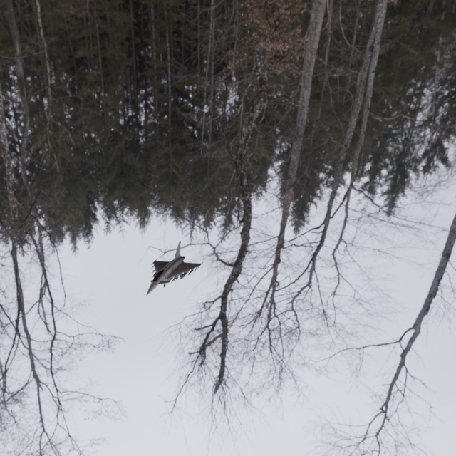
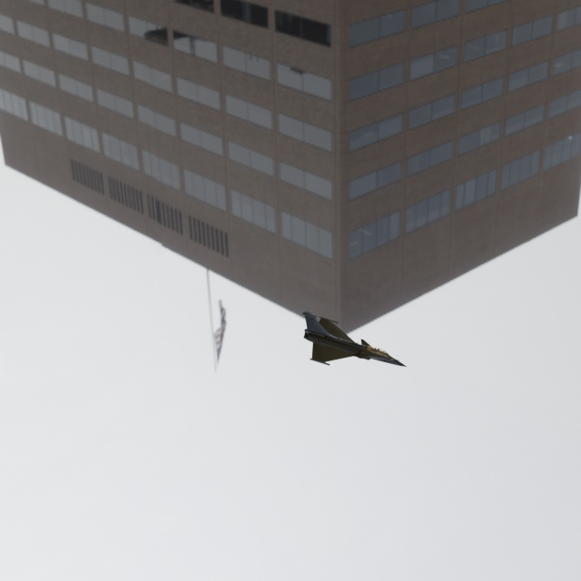
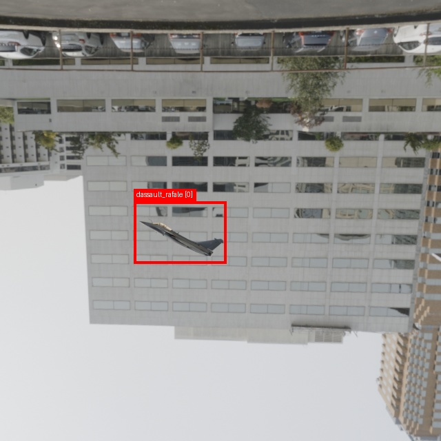

Blender Synthetic Dataset Generator
A Blender-based pipeline for automatically generating synthetic computer vision datasets from 3D models.
The generator randomizes aircraft pose, camera angle, camera distance, focal length, lighting, and HDRI environments, while automatically generating YOLO bounding-box annotations and metadata.
Demo
Synthetic Render

Different Environment and Camera View

Automatic YOLO Annotation

Features
Automatic loading of multiple 3D models
Automatic loading and cycling of HDRI environments
Random camera position, angle, distance, and focal length
Random object orientation
Random HDRI rotation and lighting intensity
Automatic YOLO bounding-box generation
Automatic metadata generation
Configurable dataset size
Automatic switching between models and environments
Support for GLB, GLTF, FBX, OBJ, STL, and BLEND files
How It Works
Scan and validate the 3D model directory
Scan and validate the HDRI environment directory
Load a model and an environment
Randomize object pose
Randomize camera position, distance, angle, focal length, and framing
Randomize lighting and HDRI rotation
Render the image
Calculate the object bounding box
Save the YOLO annotation
Save image metadata
Repeat until the requested dataset size is reached
Project Structure
```text
blender-synthetic-dataset-generator/
│
├── blender_jet_dataset_generator.py
├── draw_labels.py
├── example_scene.blend
├── README.md
├── .gitignore
│
├── assets/
│   └── readme/
│       ├── rafale_forest.jpg
│       ├── eurofighter_city.jpg
│       └── labeled_example.jpg
│
├── models/
│   └── fighters/
│
├── spaces/
│
└── examples/
    ├── images/
    ├── drawn_labels/
    ├── labels/
    ├── metadata/
    └── classes.txt
```
Main Configuration
The main dataset settings are located near the top of `blender_jet_dataset_generator.py`.
```python
MAX_IMAGES_PER_ENV = 10
IMAGES_PER_OBJECT = 5
TOTAL_IMAGES = 100
```
`MAX_IMAGES_PER_ENV`: Maximum number of images generated before switching environments.
`IMAGES_PER_OBJECT`: Number of images generated for each 3D model before switching models.
`TOTAL_IMAGES`: Total number of images to generate.
Models and environments automatically cycle until the requested total number of images is reached.
Camera Randomization
For each image, the camera can randomly change:
distance from the object
azimuth
elevation
focal length
horizontal framing
vertical framing
This prevents the subject from always appearing at the same size, position, or viewing angle.
Object Randomization
The 3D subject can be randomly rotated using yaw, pitch, and roll to increase dataset diversity.
HDRI Environment Randomization
HDRI environments are used as both background and environment lighting. The script can randomize HDRI rotation, HDRI intensity, and additional directional lighting.
Dataset Output
The generator creates an output structure similar to:
```text
outputs/
├── images/
├── labels/
├── metadata/
└── classes.txt
```
Images
Rendered RGB images generated by Blender.
YOLO Labels
Each image has a corresponding YOLO object detection label in this format:
```text
class_id center_x center_y width height
```
All coordinates are normalized between `0` and `1`.
Example:
```text
0 0.512341 0.463210 0.324510 0.217820
```
Metadata
Each image can also include a JSON metadata file containing information such as:
model name
environment name
camera distance
camera focal length
camera angle
camera shift
subject orientation
lighting parameters
bounding box coordinates
Automatic Label Visualization
The repository also includes `draw_labels.py`.
This script reads the generated YOLO labels and draws bounding boxes on the rendered images, making it easy to visually verify annotation quality.
Running the Generator
Open Blender.
Open the Scripting workspace.
Open `blender_jet_dataset_generator.py`.
Configure `MODEL_FOLDER`, `ENV_FOLDER`, and `OUTPUT_FOLDER`.
Configure dataset settings such as `MAX_IMAGES_PER_ENV`, `IMAGES_PER_OBJECT`, and `TOTAL_IMAGES`.
Click Run Script.
The script first validates the available assets.
Example:
```text
[OK] MODEL: dassault_rafale.glb
[OK] MODEL: eurofighter_typhoon_3d.glb

[OK] ENV: hochsal_forest_4k.exr
[OK] ENV: portland_landing_pad_4k.exr

READY: 3 valid object(s), 2 valid environment(s)
```
After validation, dataset generation starts automatically.
Visualizing the Labels
After generating the dataset, run `draw_labels.py` to read the generated images, labels, and `classes.txt`, then create images with visible bounding boxes.
Assets
Large 3D models and HDRI files are intentionally excluded from the repository through `.gitignore`.
Examples:
```text
*.glb
*.exr
*.hdr
```
Users should provide their own 3D models and HDRI environments. This makes the pipeline reusable for many different categories, including aircraft, cars, drones, robots, industrial parts, machinery, and products.
Current Example Dataset
The current demo focuses on fighter aircraft using multiple 3D models and HDRI environments such as forest and city / landing-pad scenes.
Why Synthetic Data?
Real-world computer vision datasets can require significant data collection, manual annotation, time, and cost.
Synthetic data can automate much of this process while giving precise control over object pose, camera pose, lighting, background, scale, framing, dataset size, and annotations.
Possible Future Improvements
Real 3D environments instead of HDRI-only backgrounds
Realistic object occlusion
Segmentation masks
Depth maps
Normal maps
Multiple objects per image
COCO annotation format
Automatic train / validation / test split
Stronger domain randomization
Motion blur
Atmospheric effects
Cycles rendering
Command-line execution
Configuration file support
Notes
HDRI files are used as environment backgrounds and lighting sources. They are not full 3D scenes, so objects cannot currently move behind trees or buildings inside the HDRI.
Future versions can add real 3D environments for realistic occlusion.
License
The source code can be distributed under the MIT License.
3D models and HDRI assets may have separate licenses and are not automatically covered by this repository's source code license.
Author
Sperlos-geek
Computer Vision · Synthetic Data · Blender · Python